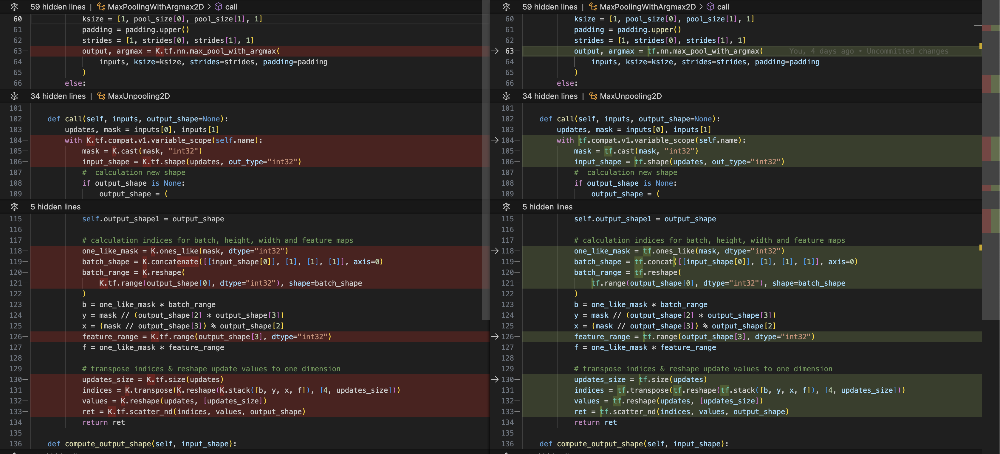

# CHANGELOG (3rd Feb 2024)

## System configuration

* Hardware - Apple M2 Pro Chip
* OS - MacOS 14.3
* Python version - v3.8.18
* Pip - v23.0.1

## Package Versions

1. tensorflow==2.13.0
2. tensorflow-metal - Optional and only for Apple silicon
3. keras==2.13.1
4. numpy==1.24.3
5. scikit-image==0.21.0
6. matplotlib==3.3.4
7. opencv-python==4.9.0.80
8. astropy==5.2.2

## Code Change

1. FibrilNet.py

The **left section** of this image in **red** is **old code** and the **right section** in **green** is **new code**

